# DejaDo

**Your agent did this yesterday.** DejaDo records how an agent did a task, boils the session down to a short procedure, and hands that procedure to the next agent that gets the same kind of task. Devin, Claude Code, Codex, a browser agent and a robot all write into one memory and read from it.

Live console, no login: **https://headstart-demo.vercel.app/dash/enterprise**. Every number on it is a recorded session, not an estimate. Built at HackMIT 2026 for the Devin track.

`headstart` is the CLI, `dejado` is its alias.

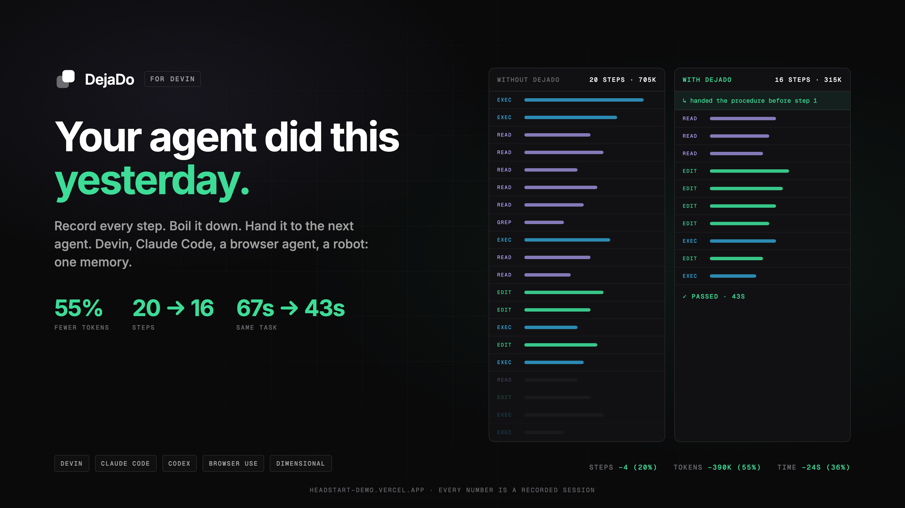

## The problem

Every agent session starts from zero. Devin reads the same twelve files, runs the same `find`, greps the same names, then makes the same three edits someone else's Devin made last week. We watched it do that across 200 recorded sessions. Roughly the first half of every session is rediscovery.

## What DejaDo does

1. Hooks inside the agent write down every tool call as it happens: what it ran, what it read, what it edited, whether it worked.
2. When the session ends, the trace is boiled down to a procedure: the steps that mattered, the files they touched, the check at the end. No model in that loop.
3. Before the next session on a similar task, the agent is handed the closest procedure. It skips the search and starts on the right files.

## The console

### Pick the agent

The console is set up for one use case at a time. The picker under the wordmark switches between Devin, Claude Code, Codex, Browser Use, Dimensional (a robot on dimOS) and a custom agent. Every page then shows only that agent's sessions.

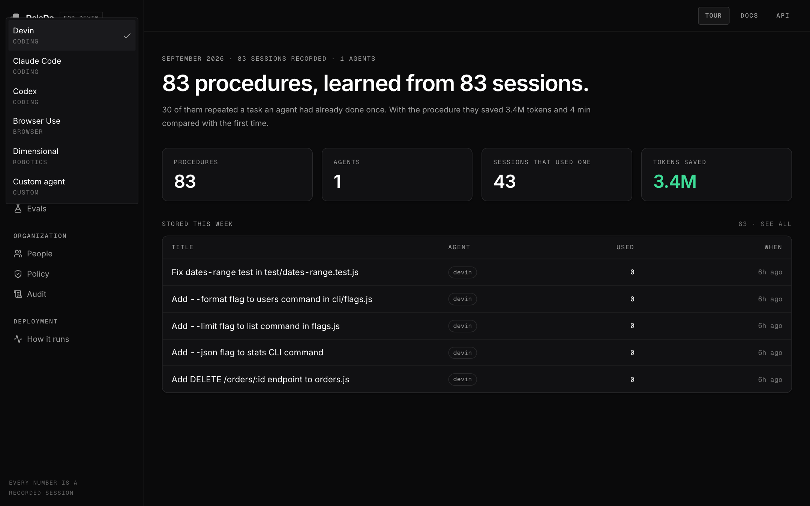

### Evals: the same task, twice

One session that had nothing, next to one that was handed the procedure. Same task, same model. Hit Enter and both traces play in from their recorded timestamps: steps, tokens and seconds count up on each side, and the DejaDo side finishes first.

The pair shown: add a `DELETE /orders/:id` endpoint. Without memory Devin spends its first nine steps on `find`, `grep` and reads. With memory it opens the right files and edits by step seven. 20 steps to 16, 705k tokens to 315k, 67 s to 43 s.

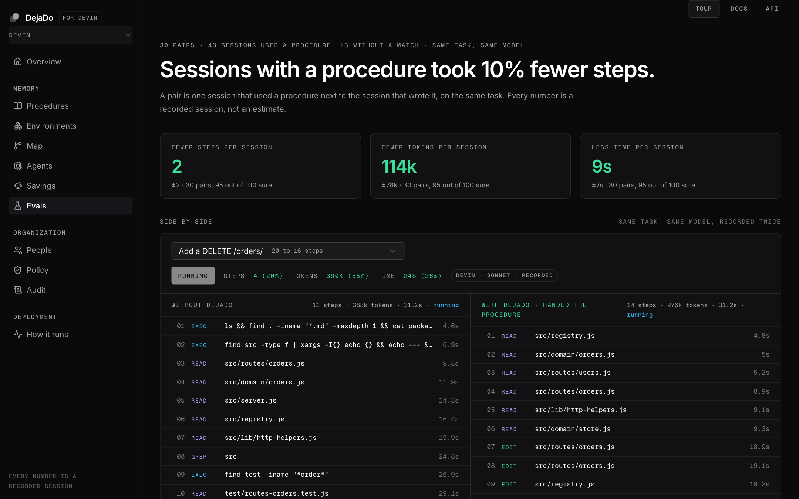

Across all 30 recorded Devin pairs: 10 out of 100 fewer steps, 114k fewer tokens, 9 s less per session. Claude Code, 38 pairs: 245k fewer tokens, 14 s less.

### Procedures

Every stored procedure, who wrote it, how many times it was used, how many of those sessions went well. Open one to see its steps, what had to be true first, and what was checked at the end.

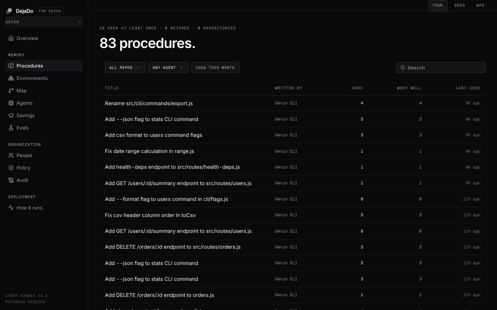

### Map

Every step agents share, as one map. A procedure is a path left to right. Where two procedures ran the same step, the paths meet. Search a procedure and its whole path lights up; click a step to see who passes through it.

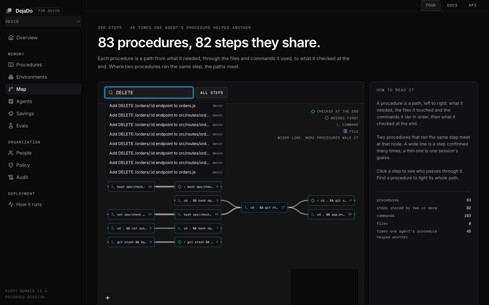

### Environments and replays

Each use case lists its recorded environments. Two of them ship a replay of what actually happened, frame by frame.

**Browser Use.** Two fresh agents visit a public site. The second one is handed the first one's procedure before it starts. Real screenshots, real tool events, verified final page.

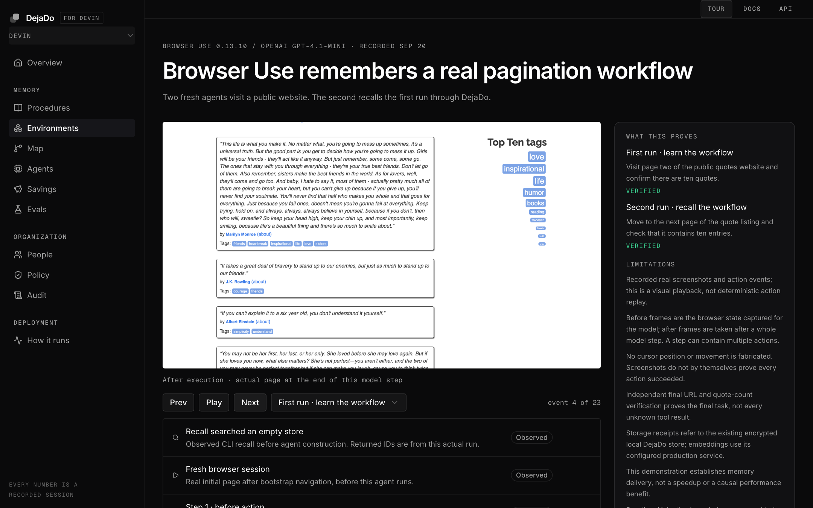

**Dimensional (robot).** A model drives a MuJoCo robot through MCP. The mission is stored; the next mission is handed it. Captured camera frames and measured poses. The first attempt failed its arrival check and the recording says so.

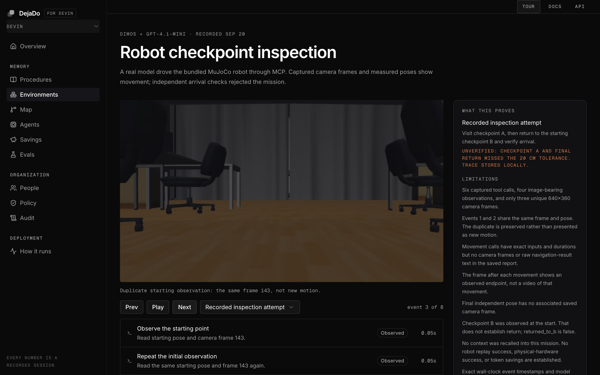

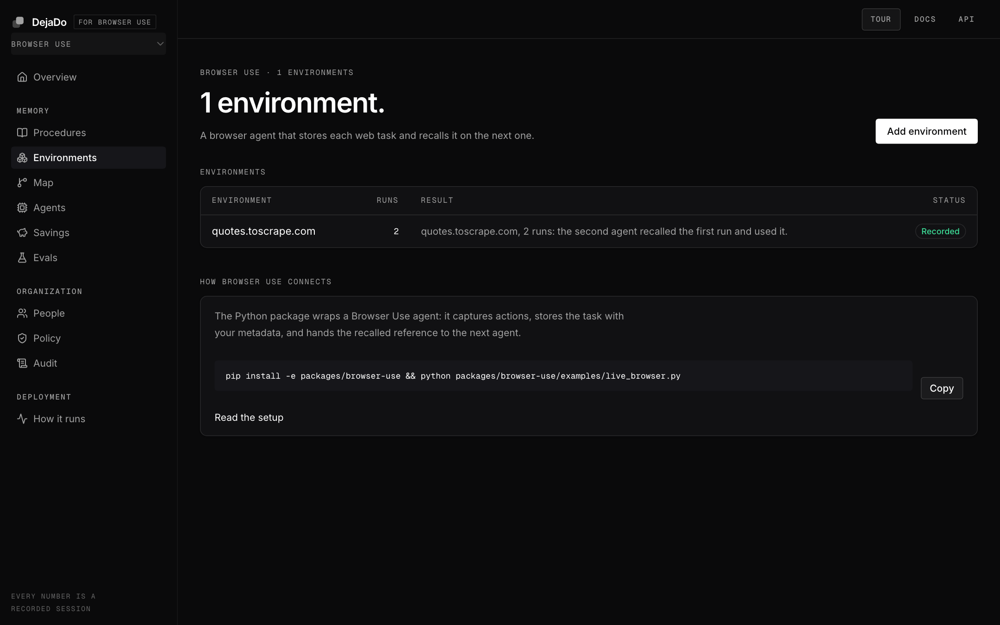

Add environment defines a new one: name, use case, repository, when to store, when to recall, which metadata fields are filters and which are searched. It gives back the setup and the connect command.

### How it runs

Every way an agent can connect: hooks in Claude Code, Devin CLI and Codex; `headstart connect` to inspect a repository's seams; the SDK's `store()` and `recall()`; the metadata SDK; the Browser Use package; the Dimensional adapter; MCP; HTTP `POST /v1/extract` and `/v1/recall`; `headstart push` and `backfill`; skill files.

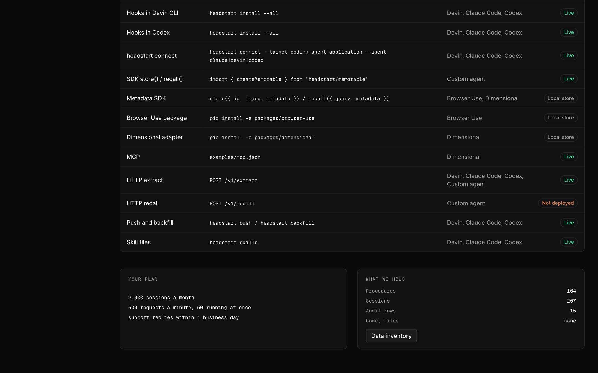

### Agents

Which agents have written into the memory, and how often one agent's procedure was used by another. 50 times so far, Claude Code to Devin and back.

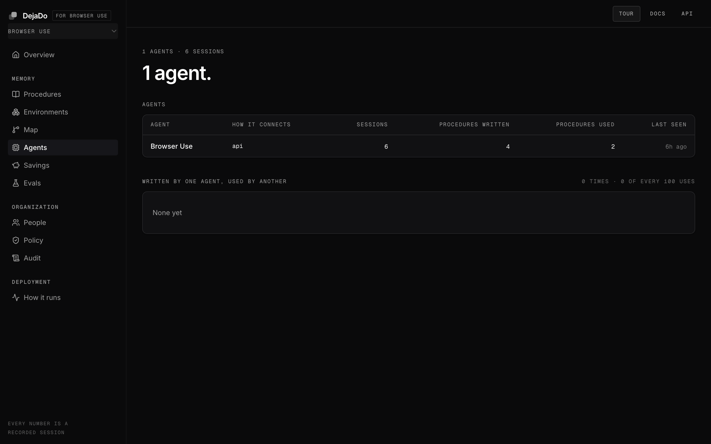

## The numbers

| Use case | Sessions | Pairs | Per session, with a procedure |
|---|---:|---:|---|
| Devin | 83 | 30 | 2 fewer steps, 114k fewer tokens, 9 s less |
| Claude Code | 106 | 38 | 2 fewer steps, 245k fewer tokens, 14 s less |
| Browser Use | 6 | 2 | ten-page audit: 1.0M to 853k tokens, 296 s to 240 s, 73 to 59 actions |
| Dimensional | 5 | 2 | inspection mission: 8 to 6 tool calls, 7,265 to 5,217 tokens |
| Codex | 3 | 0 | recorded, not yet paired |

A pair is one session that used a procedure next to the same agent's earlier session on the same task that had nothing. Spread is wide on a single pair; the console shows the 95 out of 100 range next to every mean.

## Run it yourself

```sh
npm install
headstart install                                  # hooks for Claude Code, Devin CLI, Codex on this machine
headstart demo --agent devin --task bugfix-1       # the same task cold, then with memory, two lanes
headstart console --live                           # the local console: lanes, the Race tab (Enter runs both at once)
headstart orchestrate --plan fixtures/orchestrate-demo.json   # waves of agents; wave two recalls what wave one stored
```

Browser and robot demos: `pip install -e packages/browser-use` then `python packages/browser-use/examples/live_browser.py`; `pip install -e packages/dimensional` then `python packages/dimensional/examples/inspection.py`.

## What is real and what is not

- Every session on the console was recorded by hooks or an adapter and pushed to the store. Nothing is simulated.
- The browser and robot sessions were pushed from the recordings in this repository (`scripts/evidence-sessions.mjs`). For the ten-page browser audit the original step history was not kept, so the order of its actions is rebuilt from the recorded action counts; tokens, time, counts and verdicts are the recorded ones.
- The procedure that helped on one pair did not help on every pair. The Devin eval rounds are in `results/` unedited, negative pairs included.
- Devin Cloud sessions from the console are not built. Pin and Retire need a migration that is not applied on the demo database.

## Slides

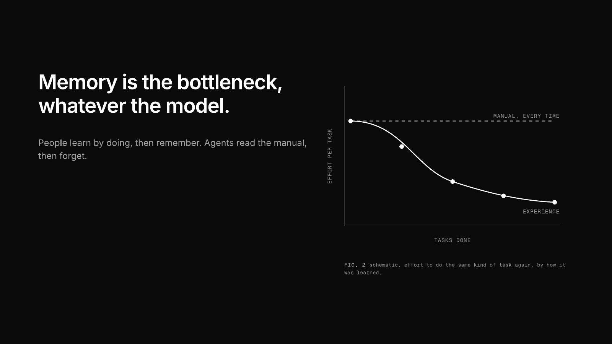


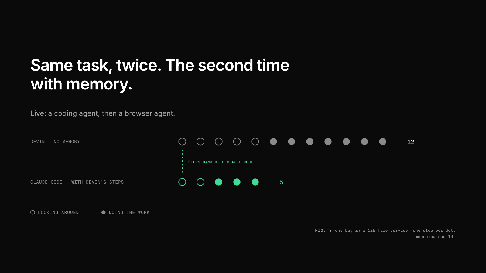

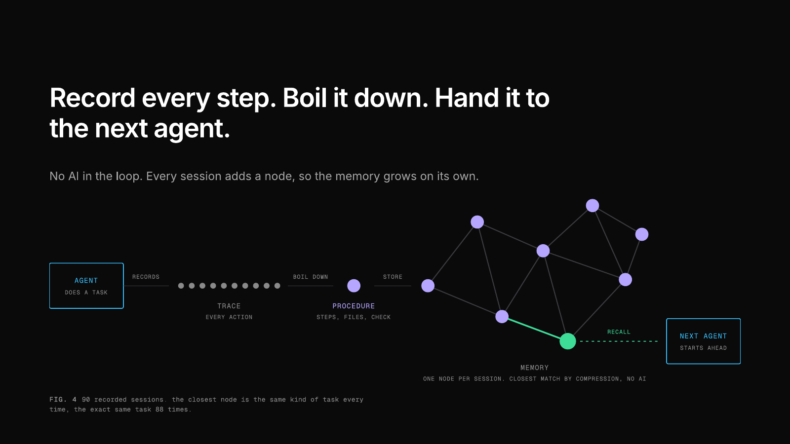

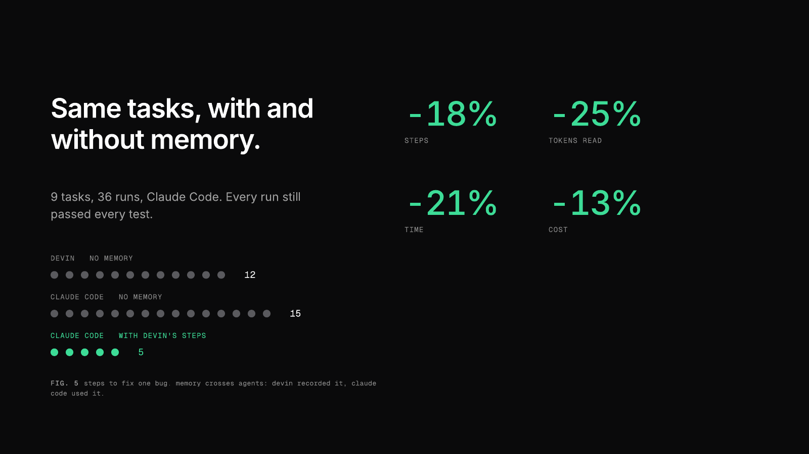

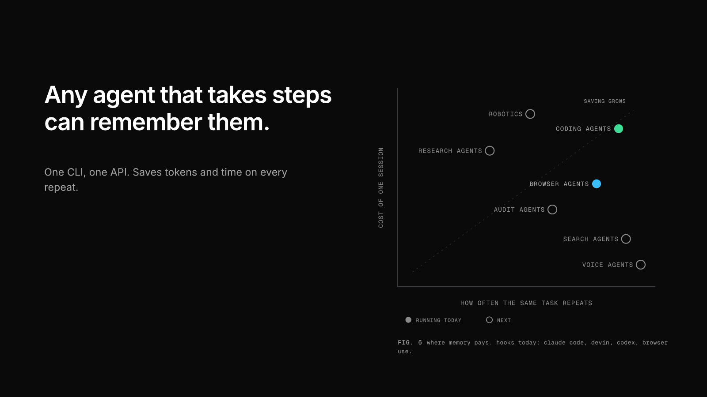

## Team

Nikhil Krishnaswamy and Advaiyt Sane. HackMIT 2026.

---

## Demos on this branch

Everything below is on `main` now: the coding-agent demo, the browser demo, the robotics demo, their recordings, and the console that plays them back.

| Demo | Run it | Recording |
|---|---|---|
| Devin, before and after memory | `headstart demo --agent devin --task bugfix-1` (two lanes in `headstart console --live`) | [hosted console](https://headstart-demo.vercel.app/dash/enterprise), use case Devin |
| Browser Use, a web task recalled by the next agent | `pip install -e packages/browser-use && python packages/browser-use/examples/live_browser.py` | [replay](https://headstart-demo.vercel.app/dash/enterprise/environments/browser), [evidence](docs/verification/2026-09-20-browser-replay.md) |
| Browser Use, ten-page audit with and without memory | `python packages/browser-use/examples/long_task_benchmark.py` | [numbers and limits](docs/verification/2026-09-20-long-browser-task.md) |
| Dimensional (dimOS), a robot mission recalled through MCP | `pip install -e packages/dimensional && python packages/dimensional/examples/inspection.py` | [replay](https://headstart-demo.vercel.app/dash/enterprise/environments/dimensional), [evidence](packages/dimensional/evidence/2026-09-20-verified-inspection/report.json), [notes](docs/DIMENSIONAL.md) |
| Multi-agent orchestration | `headstart orchestrate --plan fixtures/orchestrate-demo.json` | [DEMO.md](docs/DEMO.md) |

The hosted console shows every recorded session per use case (Devin, Claude Code, Codex, Browser Use, Dimensional): pick one in the sidebar. The browser and robot recordings were pushed to it with `scripts/evidence-sessions.mjs`. The [three-minute runbook](docs/DEMO-RUNBOOK.md) walks the pitch.

## Dashboard and recorded demos

The [Workflow Studio source](apps/workflow-studio/README.md) includes the
central environment console, metadata setup, and visual replay player with
captured Browser Use and Dimensional traces. [Open the hosted demo](https://memorable-workflow-studio.ahsane692499.chatgpt.site/?environment=replay).

See the [Browser Use recorder](docs/verification/2026-09-20-browser-replay.md)
and the [long-task benchmark](docs/verification/2026-09-20-long-browser-task.md)
for provenance and limits. The latter contains failed runs, not a verified
successful-task savings claim.

## What lives where

| Component | Responsibility | Status |
|---|---|---|
| This repository | Importable connector, coding-agent hook adapter, integration documentation, verification evidence | Branch implementation |
| Optional [Browser Use package](packages/browser-use/README.md) | Python capture and developer-defined metadata through native CLI | Local store/recall and live model context verified; companion CLI patch required |
| [Memorable upstream](https://github.com/NIkhil-cmd-cmd/memorable-gbrain) | CLI, shared procedure/retrieval code, extraction service and other Memorable applications | Separate private monorepo; not just a GBrain plugin |
| Existing `memorable-cli` | `ingest -`, `recall`, `show`, `chain`, and local MCP access | Published CLI; see [CLI docs](https://www.memorable.sh/docs/cli) |
| Existing HTTP API | Extraction and query embeddings | [Documented API](https://www.memorable.sh/docs/api); extraction response alone is not a durable storage receipt |
| HTTP recall transport | Remote store/read contract without a local CLI process | Pending upstream review, deployment, documentation and a real round trip |

The prior Headstart local lexical engine and evaluation tools remain available under `HEADSTART_BACKEND=local`, the default. They are separate from Memorable's retrieval. Existing local evaluation results do not verify the new connector or hosted retrieval.

The current [SDK plan](docs/SDK-PLAN.md) supersedes the architecture direction in [the historical demo plan](docs/PLAN.html). See [connections](docs/CONNECTIONS.md) for setup and [verification](docs/VERIFICATION.md) for what counts as evidence.

## Legacy extraction interface

Use Node.js 24 or newer. Install this checkout as a local dependency in the consuming project:

```sh
npm install /path/to/environment-mem
```

Installation builds JavaScript entrypoints for the SDK and CLI; TypeScript source remains available for types. For development in the checkout, run `npm run build` before using `bin/headstart`.

Install/authenticate `memorable-cli` using the [official integration instructions](https://www.memorable.sh/docs/integrate). The SDK uses the configured CLI's credentials and storage; it does not provision a database or change its backend.

```ts
import { createMemorable } from 'headstart/memorable';

const memory = createMemorable({ command: 'memorable', cwd: process.cwd() });

// Before the agent starts work. The caller chooses how to use this text.
const recalled = await memory.recall({ query: 'Add a retry regression test' });
console.log(recalled.stdout);

// After this task finishes and tool results have been joined to their calls.
const stored = await memory.store({
  session_id: 'session-1',
  workflow_id: 'run-1',
  task_description: 'Add a retry regression test',
  harness: 'codex',
  tool_calls: [
    { name: 'exec_command', input: { cmd: 'npm test' }, result: { exit_code: 0 } },
  ],
});
console.log(stored.stdout);
```

The small trace above illustrates the envelope only; it is not evidence of a captured agent run or a useful learned procedure. Pass the actual completed calls for the whole task.

`store()` runs `memorable ingest -`. A successful `command_completed` result means the CLI exited successfully; it does **not** promise durable remote storage, extraction admission, or index readiness. `recall({ query })` runs CLI recall and returns its text; `recall({ procedureId })` runs `show`. It does **not** return the original full trace. No undocumented JSON output is assumed.

## See it run

From this repo, three terminals. Every line is a real agent session in a fresh copy of `fixtures/repo` with the hooks on.

```
headstart console --live                                             # http://localhost:4177, one lane per run
headstart demo --agent devin --task bugfix-1                          # before and after, one command
headstart run --agent devin  --lane devin-cold  --task bugfix-1 --inject 0   # cold: nothing handed
headstart run --agent claude --lane claude-warm --task bugfix-1              # warm: handed what the cold run stored
headstart orchestrate --fresh                                        # six agents in three waves, hand-offs across Devin and Claude
```

`docs/DEMO.md` has the script and the measured numbers. `docs/ARCHITECTURE.png` is the picture.


## Connect hooks

Run these commands from the agent's project, using this checkout's executable:

```sh
node /path/to/environment-mem/src/cli.ts init --backend memorable
node /path/to/environment-mem/src/cli.ts install
```

The installer pins the absolute Node executable and CLI path, preserves unrelated hooks and rejects malformed settings. It writes project Claude-format hooks; `install --all` also writes the configured user-level Devin and Codex hook files. Verify the target host/version and enablement before relying on an installer result.

`init --backend memorable` saves the project setting. `HEADSTART_BACKEND` overrides it. Use `HEADSTART_MEMORABLE_BIN` for the Memorable executable, `HEADSTART_MEMORABLE_ARGS` for a JSON array of launcher arguments, and `HEADSTART_HARNESS` for the actual tool schema (`headstart` by default). See [connection settings](docs/CONNECTIONS.md).

The adapter's lifecycle is: prompt starts a run and recalls a candidate listing → completed tool events are captured → task stop submits that run. It forwards the captured calls rather than the local extracted procedure and hashes session/run IDs into stable CLI-safe identities. Missing tool outcomes remain unknown. The listing is injected as reference data; use `headstart recall --procedure <slug>` to read a full rendered procedure. It is still not the original trace.

Failed submissions remain in the local outbox. `headstart connection` reports pending submissions; `headstart sync` explicitly retries them. A completed CLI command may itself have queued work, so an empty local outbox is not a durable-storage guarantee. A timeout can occur after the upstream operation has taken effect.

The local DejaDo demo procedures live in `.headstart/procedures.jsonl`. On that separate local path, with `HEADSTART_API_URL` and `HEADSTART_API_KEY` set, every finished session is also posted to `POST /v1/extract` (tool calls, cost, what it was handed) and the enterprise dashboard reads those rows.

For a custom agent, call the SDK from your own lifecycle directly. You do not need the hook installer, a dashboard, or a pasted sample trace.

Platform packages remain optional. The core exports `loadAdapter` / `invokeAdapter`
from `headstart/adapters` and offers `headstart memory store|recall --adapter <file>`.
Developers can implement a local module with those two methods without changing
the main CLI. The [Browser Use add-on](packages/browser-use/README.md) adds no browser dependency
to the core. Its current metadata client calls the native Memorable CLI directly.
Its retained experimental HTTP driver
targets the browser-specific backend contract, because published `memorable ingest`
does not preserve browser targets and input shapes. This does not establish a
general deployed HTTP recall API.

The [Devin plan](docs/DEVIN-INTEGRATION-PLAN.md) distinguishes native CLI hooks
from hosted session APIs. The [integration shortlist](docs/INTEGRATION-SHORTLIST.md)
covers AI SDK, LangChain, Mastra and Pydantic AI without requiring Browser Use.

Use the [one-prompt integration handoff](docs/AGENT-SETUP.md) to have a coding agent connect another application and report what it actually verified.

## Evidence and limits

The [Browser Use live report](docs/verification/2026-09-19-browser-use.md) records
a real public website run with captured navigation and click targets, a retained
outbox, independently checked page contents and explicit omissions. The initial
scripted check was followed by a successful OpenAI-driven Browser Use Agent run.
The earlier browser HTTP experiment remains blocked by authorization and its
advisory-retrieval contract. The newer metadata CLI path completed the local
round trip; see the metadata evidence above.

The [September 19 live check](docs/verification/2026-09-19.md) reached the extraction service, persisted a procedure locally and read it back in fresh CLI processes. Close wording and an exact filename retrieved it; a paraphrase missed. The hook returned context, but native Claude verification was blocked by revoked authentication before tools ran. Hosted durability, HTTP recall and native context consumption remain unverified. [VERIFICATION.md](docs/VERIFICATION.md) defines the remaining evidence gates.

The metadata CLI path now preserves accepted traces, enforces metadata definitions, and returns local storage receipts. Structured HTTP recall, hosted storage, richer precondition checking and a published compatible CLI release remain upstream work.

The legacy coding hook capture retains only a 300-character result snippet plus explicit outcome fields. Events without stable IDs cannot be reliably deduplicated; overlapping tasks need explicit run IDs. Journal writes have no cross-process lock. Deterministic replay and task-success verification are not provided.

The retained `headstart eval` / `report` tools and historical reports evaluate the previous local Headstart engine. They do not establish retrieval quality or a performance benefit for this connector.
